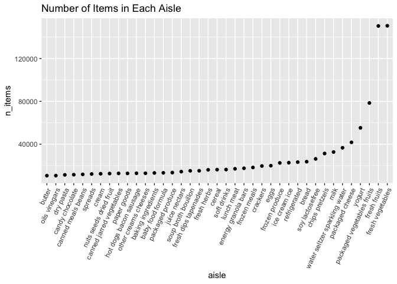
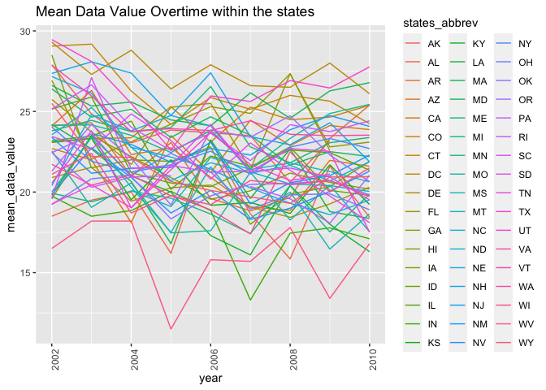
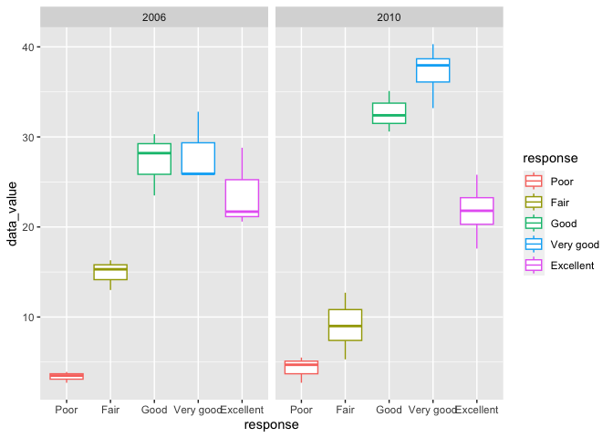
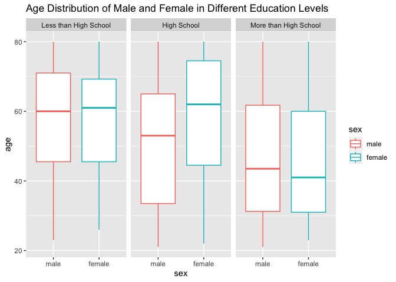
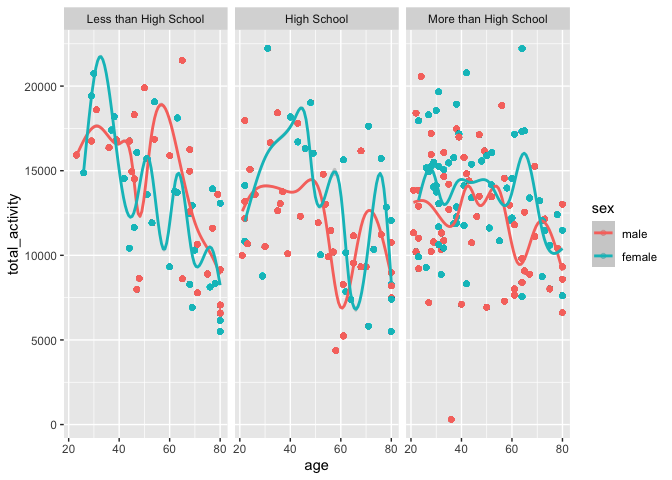
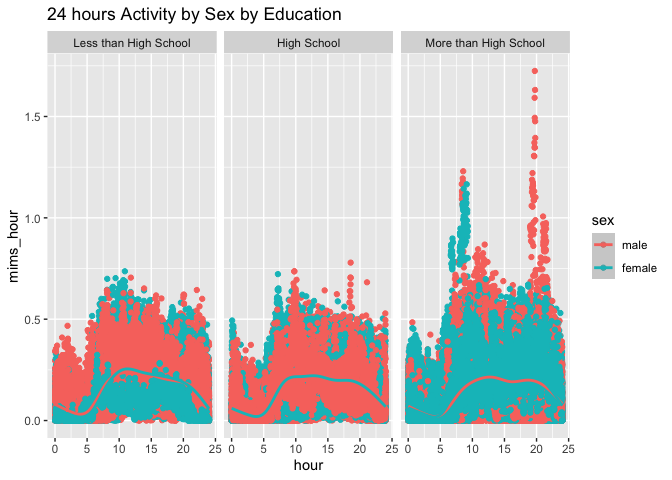

p8105_hw3_qc2336
================
Qiran Chen
2023-10-10

``` r
library(tidyverse)
```

    ## ── Attaching core tidyverse packages ──────────────────────── tidyverse 2.0.0 ──
    ## ✔ dplyr     1.1.3     ✔ readr     2.1.4
    ## ✔ forcats   1.0.0     ✔ stringr   1.5.0
    ## ✔ ggplot2   3.4.3     ✔ tibble    3.2.1
    ## ✔ lubridate 1.9.3     ✔ tidyr     1.3.0
    ## ✔ purrr     1.0.2     
    ## ── Conflicts ────────────────────────────────────────── tidyverse_conflicts() ──
    ## ✖ dplyr::filter() masks stats::filter()
    ## ✖ dplyr::lag()    masks stats::lag()
    ## ℹ Use the conflicted package (<http://conflicted.r-lib.org/>) to force all conflicts to become errors

``` r
library(ggplot2)
```

## Problem 1

``` r
library(p8105.datasets)
data("instacart")
data("brfss_smart2010")
```

``` r
tail(instacart,5)
```

    ## # A tibble: 5 × 15
    ##   order_id product_id add_to_cart_order reordered user_id eval_set order_number
    ##      <int>      <int>             <int>     <int>   <int> <chr>           <int>
    ## 1  3421063      14233                 3         1  169679 train              30
    ## 2  3421063      35548                 4         1  169679 train              30
    ## 3  3421070      35951                 1         1  139822 train              15
    ## 4  3421070      16953                 2         1  139822 train              15
    ## 5  3421070       4724                 3         1  139822 train              15
    ## # ℹ 8 more variables: order_dow <int>, order_hour_of_day <int>,
    ## #   days_since_prior_order <int>, product_name <chr>, aisle_id <int>,
    ## #   department_id <int>, aisle <chr>, department <chr>

``` r
summary(instacart)
```

    ##     order_id         product_id    add_to_cart_order   reordered     
    ##  Min.   :      1   Min.   :    1   Min.   : 1.000    Min.   :0.0000  
    ##  1st Qu.: 843370   1st Qu.:13380   1st Qu.: 3.000    1st Qu.:0.0000  
    ##  Median :1701880   Median :25298   Median : 7.000    Median :1.0000  
    ##  Mean   :1706298   Mean   :25556   Mean   : 8.758    Mean   :0.5986  
    ##  3rd Qu.:2568023   3rd Qu.:37940   3rd Qu.:12.000    3rd Qu.:1.0000  
    ##  Max.   :3421070   Max.   :49688   Max.   :80.000    Max.   :1.0000  
    ##     user_id         eval_set          order_number      order_dow    
    ##  Min.   :     1   Length:1384617     Min.   :  4.00   Min.   :0.000  
    ##  1st Qu.: 51732   Class :character   1st Qu.:  6.00   1st Qu.:1.000  
    ##  Median :102933   Mode  :character   Median : 11.00   Median :3.000  
    ##  Mean   :103113                      Mean   : 17.09   Mean   :2.701  
    ##  3rd Qu.:154959                      3rd Qu.: 21.00   3rd Qu.:5.000  
    ##  Max.   :206209                      Max.   :100.00   Max.   :6.000  
    ##  order_hour_of_day days_since_prior_order product_name          aisle_id    
    ##  Min.   : 0.00     Min.   : 0.00          Length:1384617     Min.   :  1.0  
    ##  1st Qu.:10.00     1st Qu.: 7.00          Class :character   1st Qu.: 31.0  
    ##  Median :14.00     Median :15.00          Mode  :character   Median : 83.0  
    ##  Mean   :13.58     Mean   :17.07                             Mean   : 71.3  
    ##  3rd Qu.:17.00     3rd Qu.:30.00                             3rd Qu.:107.0  
    ##  Max.   :23.00     Max.   :30.00                             Max.   :134.0  
    ##  department_id      aisle            department       
    ##  Min.   : 1.00   Length:1384617     Length:1384617    
    ##  1st Qu.: 4.00   Class :character   Class :character  
    ##  Median : 8.00   Mode  :character   Mode  :character  
    ##  Mean   : 9.84                                        
    ##  3rd Qu.:16.00                                        
    ##  Max.   :21.00

``` r
instacart|> 
  count(user_id)
```

    ## # A tibble: 131,209 × 2
    ##    user_id     n
    ##      <int> <int>
    ##  1       1    11
    ##  2       2    31
    ##  3       5     9
    ##  4       7     9
    ##  5       8    18
    ##  6       9    22
    ##  7      10     4
    ##  8      13     5
    ##  9      14    11
    ## 10      17     6
    ## # ℹ 131,199 more rows

> > This data has 1384617 observeations. Including 15 variables order
> > id, user id,product d, aisle id departmen id, aisle, department
> > order number, days since prior order, order time, product name and
> > if it is reordered. There are 131209 unique user id in the data.

``` r
instacart|>
  count(aisle,name="n_items")|>
  arrange(desc(n_items))
```

    ## # A tibble: 134 × 2
    ##    aisle                         n_items
    ##    <chr>                           <int>
    ##  1 fresh vegetables               150609
    ##  2 fresh fruits                   150473
    ##  3 packaged vegetables fruits      78493
    ##  4 yogurt                          55240
    ##  5 packaged cheese                 41699
    ##  6 water seltzer sparkling water   36617
    ##  7 milk                            32644
    ##  8 chips pretzels                  31269
    ##  9 soy lactosefree                 26240
    ## 10 bread                           23635
    ## # ℹ 124 more rows

> > There are 134 aisle in the instacart dataset. The most items order
> > aisle is fresh vegetable.

``` r
instacart|>
  count(aisle,name="n_items")|>
  filter(n_items>10000)|>
  mutate(aisle=fct_reorder(aisle,n_items))|>
  ggplot(aes(x=aisle,y=n_items))+
  geom_point()+
  theme(axis.text.x = element_text(angle = 65, vjust = 1, hjust=1))+
  ggtitle("Number of Items in Each Aisle")
```

<!-- -->

``` r
top3_product=instacart|>
  filter(aisle%in%c('baking ingredients', 'dog food care', 'packaged vegetables fruits'))|>
  group_by(aisle)|>
  count(product_name, sort=TRUE)|>
  top_n(3)
```

    ## Selecting by n

``` r
top3_product
```

    ## # A tibble: 9 × 3
    ## # Groups:   aisle [3]
    ##   aisle                      product_name                                      n
    ##   <chr>                      <chr>                                         <int>
    ## 1 packaged vegetables fruits Organic Baby Spinach                           9784
    ## 2 packaged vegetables fruits Organic Raspberries                            5546
    ## 3 packaged vegetables fruits Organic Blueberries                            4966
    ## 4 baking ingredients         Light Brown Sugar                               499
    ## 5 baking ingredients         Pure Baking Soda                                387
    ## 6 baking ingredients         Cane Sugar                                      336
    ## 7 dog food care              Snack Sticks Chicken & Rice Recipe Dog Treats    30
    ## 8 dog food care              Organix Chicken & Brown Rice Recipe              28
    ## 9 dog food care              Small Dog Biscuits                               26

``` r
coffee_apple=instacart|>
  filter(product_name==c("Pink Lady Apples", "Coffee Ice Cream"))|>
  mutate(order_dow=factor(order_dow, labels = c("Monday","Tueday","Wednesday","Thursday","Friday", "Saturday", "Sunday")))|>
  group_by(product_name,order_dow)|>
  summarize(mean_time=mean(order_hour_of_day))|>
  pivot_wider(names_from = order_dow,
              values_from = mean_time)
```

    ## Warning: There was 1 warning in `filter()`.
    ## ℹ In argument: `product_name == c("Pink Lady Apples", "Coffee Ice Cream")`.
    ## Caused by warning in `product_name == c("Pink Lady Apples", "Coffee Ice Cream")`:
    ## ! longer object length is not a multiple of shorter object length

    ## `summarise()` has grouped output by 'product_name'. You can override using the
    ## `.groups` argument.

``` r
coffee_apple
```

    ## # A tibble: 2 × 8
    ## # Groups:   product_name [2]
    ##   product_name     Monday Tueday Wednesday Thursday Friday Saturday Sunday
    ##   <chr>             <dbl>  <dbl>     <dbl>    <dbl>  <dbl>    <dbl>  <dbl>
    ## 1 Coffee Ice Cream   13.2   15        15.3     15.4   15.2     10.3   12.4
    ## 2 Pink Lady Apples   12.2   11.7      12       13.9   11.9     13.9   11.6

## Problem 2

``` r
brfss_smart_df=brfss_smart2010|>
  janitor::clean_names()|>
  rename(states_abbrev=locationabbr,
         states_county=locationdesc,
         responde_id=respid)|>
  filter(topic=="Overall Health")|>
  mutate(response=factor(response,
                         levels=c("Poor","Fair","Good","Very good","Excellent")))

brfss_smart_df
```

    ## # A tibble: 10,625 × 23
    ##     year states_abbrev states_county   class topic question response sample_size
    ##    <int> <chr>         <chr>           <chr> <chr> <chr>    <fct>          <int>
    ##  1  2010 AL            AL - Jefferson… Heal… Over… How is … Excelle…          94
    ##  2  2010 AL            AL - Jefferson… Heal… Over… How is … Very go…         148
    ##  3  2010 AL            AL - Jefferson… Heal… Over… How is … Good             208
    ##  4  2010 AL            AL - Jefferson… Heal… Over… How is … Fair             107
    ##  5  2010 AL            AL - Jefferson… Heal… Over… How is … Poor              45
    ##  6  2010 AL            AL - Mobile Co… Heal… Over… How is … Excelle…          91
    ##  7  2010 AL            AL - Mobile Co… Heal… Over… How is … Very go…         177
    ##  8  2010 AL            AL - Mobile Co… Heal… Over… How is … Good             224
    ##  9  2010 AL            AL - Mobile Co… Heal… Over… How is … Fair             120
    ## 10  2010 AL            AL - Mobile Co… Heal… Over… How is … Poor              66
    ## # ℹ 10,615 more rows
    ## # ℹ 15 more variables: data_value <dbl>, confidence_limit_low <dbl>,
    ## #   confidence_limit_high <dbl>, display_order <int>, data_value_unit <chr>,
    ## #   data_value_type <chr>, data_value_footnote_symbol <chr>,
    ## #   data_value_footnote <chr>, data_source <chr>, class_id <chr>,
    ## #   topic_id <chr>, location_id <chr>, question_id <chr>, responde_id <chr>,
    ## #   geo_location <chr>

``` r
brfss_smart_df|>
  filter(year=="2002")|>
  group_by(states_abbrev)|>
  summarize(n_location=n_distinct(states_county))|>
  filter(n_location >=7)
```

    ## # A tibble: 6 × 2
    ##   states_abbrev n_location
    ##   <chr>              <int>
    ## 1 CT                     7
    ## 2 FL                     7
    ## 3 MA                     8
    ## 4 NC                     7
    ## 5 NJ                     8
    ## 6 PA                    10

``` r
brfss_smart_df|>
  filter(year=="2010")|>
  group_by(states_abbrev)|>
  summarize(n_location=n_distinct(states_county))|>
  filter(n_location >=7)
```

    ## # A tibble: 14 × 2
    ##    states_abbrev n_location
    ##    <chr>              <int>
    ##  1 CA                    12
    ##  2 CO                     7
    ##  3 FL                    41
    ##  4 MA                     9
    ##  5 MD                    12
    ##  6 NC                    12
    ##  7 NE                    10
    ##  8 NJ                    19
    ##  9 NY                     9
    ## 10 OH                     8
    ## 11 PA                     7
    ## 12 SC                     7
    ## 13 TX                    16
    ## 14 WA                    10

> > There are 6 states observed in 2002, and 14 states in 2010.

``` r
brfss_smart_df|>
  filter(response=="Excellent")|>
  group_by(year, states_abbrev)|>
  summarize(mean_data_value=mean(data_value))|>
  ungroup()|>
  ggplot(aes(x=year,y=mean_data_value, color=states_abbrev, na.rm= TRUE))+
  geom_line()+
  theme(axis.text.x = element_text(angle = 90, vjust = 1, hjust=0.2))+
  labs( title = "Mean Data Value Overtime within the states") 
```

    ## `summarise()` has grouped output by 'year'. You can override using the
    ## `.groups` argument.

    ## Warning: Removed 3 rows containing missing values (`geom_line()`).

<!-- -->
\>\>This result shows the mean data value over time with in the state.

``` r
brfss_smart_df|>
  filter(year==c("2006","2010"),states_abbrev=="NY")|>
  ggplot(aes(x=response,y=data_value,color=response))+
  geom_boxplot(binwidth = 0.5)+
  facet_grid(.~year)
```

    ## Warning: There was 1 warning in `filter()`.
    ## ℹ In argument: `year == c("2006", "2010")`.
    ## Caused by warning in `year == c("2006", "2010")`:
    ## ! longer object length is not a multiple of shorter object length

    ## Warning in geom_boxplot(binwidth = 0.5): Ignoring unknown parameters:
    ## `binwidth`

<!-- -->

## Problem 3

``` r
covar<-read_csv("./nhanes_covar.csv",skip=4)
```

    ## Rows: 250 Columns: 5
    ## ── Column specification ────────────────────────────────────────────────────────
    ## Delimiter: ","
    ## dbl (5): SEQN, sex, age, BMI, education
    ## 
    ## ℹ Use `spec()` to retrieve the full column specification for this data.
    ## ℹ Specify the column types or set `show_col_types = FALSE` to quiet this message.

``` r
accel<-read_csv("./nhanes_accel.csv")
```

    ## Rows: 250 Columns: 1441
    ## ── Column specification ────────────────────────────────────────────────────────
    ## Delimiter: ","
    ## dbl (1441): SEQN, min1, min2, min3, min4, min5, min6, min7, min8, min9, min1...
    ## 
    ## ℹ Use `spec()` to retrieve the full column specification for this data.
    ## ℹ Specify the column types or set `show_col_types = FALSE` to quiet this message.

``` r
covar=covar|>
  drop_na()|>
  filter(age>=21)|>
  mutate(education=factor(education,labels=c("Less than High School", "High School", "More than High School")),
         sex=factor(sex,labels=c("male","female")))
covar
```

    ## # A tibble: 228 × 5
    ##     SEQN sex      age   BMI education            
    ##    <dbl> <fct>  <dbl> <dbl> <fct>                
    ##  1 62161 male      22  23.3 High School          
    ##  2 62164 female    44  23.2 More than High School
    ##  3 62169 male      21  20.1 High School          
    ##  4 62174 male      80  33.9 More than High School
    ##  5 62177 male      51  20.1 High School          
    ##  6 62178 male      80  28.5 High School          
    ##  7 62180 male      35  27.9 More than High School
    ##  8 62184 male      26  22.1 High School          
    ##  9 62189 female    30  22.4 More than High School
    ## 10 62199 male      57  28   More than High School
    ## # ℹ 218 more rows

``` r
covar|>
  group_by(education)|>
  count(sex)
```

    ## # A tibble: 6 × 3
    ## # Groups:   education [3]
    ##   education             sex        n
    ##   <fct>                 <fct>  <int>
    ## 1 Less than High School male      27
    ## 2 Less than High School female    28
    ## 3 High School           male      35
    ## 4 High School           female    23
    ## 5 More than High School male      56
    ## 6 More than High School female    59

``` r
covar|>
ggplot(aes(x=sex,y=age,color=sex))+
  geom_boxplot()+
  facet_grid(.~education)+
  ggtitle("Age Distribution of Male and Female in Different Education Levels")
```

<!-- -->
\>\> The table shows there are more male and female who has a more than
high school, the age distribution shows they are younger in age. Male
and Female who had less than high school and high school education are
relatively similar in number.The mean age of Less than high school is
older than the other two. The high school education male and female has
a more salient difference in age.

Traditional analyses of accelerometer data focus on the total activity
over the day. Using your tidied dataset, aggregate across minutes to
create a total activity variable for each participant. Plot these total
activities (y-axis) against age (x-axis); your plot should compare men
to women and have separate panels for each education level. Include a
trend line or a smooth to illustrate differences. Comment on your plot.

Accelerometer data allows the inspection activity over the course of the
day. Make a three-panel plot that shows the 24-hour activity time
courses for each education level and use color to indicate sex. Describe
in words any patterns or conclusions you can make based on this graph;
including smooth trends may help identify differences.

``` r
accel1=accel|>
  pivot_longer(min1:min1440,
               names_to="minutes",
               names_prefix = "min",
               values_to="mims")
```

``` r
nhanes_min=accel1|>
  group_by(SEQN)|>
  mutate(total_activity=sum(mims))|>
  full_join(covar)|>
  drop_na(education)
```

    ## Joining with `by = join_by(SEQN)`

``` r
nhanes_min|>
  ggplot(aes(x=age,y=total_activity,color=sex))+
  geom_point(alpha = .5)+
  geom_smooth()+
  facet_grid(.~education)
```

    ## `geom_smooth()` using method = 'gam' and formula = 'y ~ s(x, bs = "cs")'

<!-- -->
\>\> Younger female participants are more active compare to other groups
especially in the less than high school education level.Older male with
lower education level is more active comparing to males in other groups,
older female feaks in activity in high education level but not in the
others.

``` r
nhanes_24=nhanes_min|>
  mutate(mims_hour=mims/60,
         minutes=as.numeric(minutes),
         hour=minutes/60)|>
  ggplot(aes(x=hour, y=mims_hour,color=sex))+
  geom_point()+
  facet_grid(.~education)+
  geom_smooth()+
  labs(title="24 hours Activity by Sex by Education")

nhanes_24
```

    ## `geom_smooth()` using method = 'gam' and formula = 'y ~ s(x, bs = "cs")'

<!-- -->
\>\> The higher edcuation level has more acitivity in mims in early and
late hour while other level are more evenly distributed. However, the
smooth line shows all grouos have a similar patterm overall.
